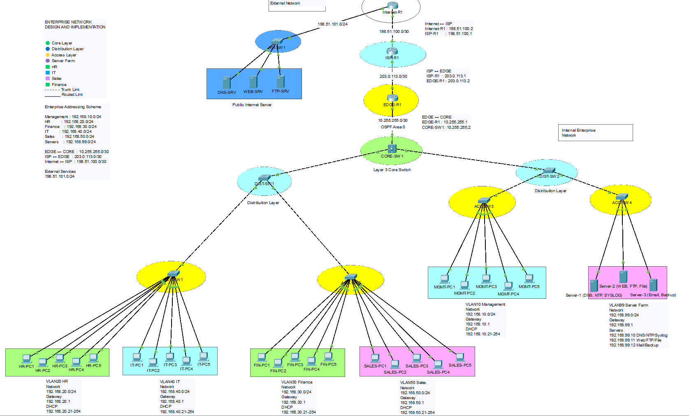

<div align="center">

# 🌐 Enterprise Network Design & Implementation

### Cisco Packet Tracer Enterprise Campus Network Simulation

<p>
A production-inspired enterprise campus network implementing Cisco's hierarchical design model with secure routing, switching, enterprise services, and network security.
</p>

<p>


</p>

</div>

---

# 📖 Project Overview

This project simulates a real-world **Enterprise Campus Network** using **Cisco Packet Tracer**.

The network follows Cisco's **Three-Tier Hierarchical Architecture**, consisting of Core, Distribution, and Access layers. It demonstrates enterprise networking concepts including VLAN segmentation, Layer 3 switching, dynamic routing, centralized network services, secure remote management, and Internet connectivity.

The project was developed as part of my networking portfolio to demonstrate practical knowledge of enterprise network design and implementation.

---

# 🖼 Enterprise Network Topology

<p align="center">



</p>

---

# 🏗 Network Architecture

```
                    Internet
                        │
                Internet Router
                        │
                   ISP Router
                        │
                   Edge Router
                        │
               Layer 3 Core Switch
                 /               \
       Distribution         Distribution
          Switch               Switch
         /      \             /      \
    Access    Access     Access    Access

          Enterprise Departments
```

---

# 📊 Project Statistics

| Component | Quantity |
|-----------|---------:|
| Routers | 3 |
| Layer 3 Switch | 1 |
| Distribution Switches | 2 |
| Access Switches | 4 |
| VLANs | 6 |
| Internal Servers | 3 |
| Public Servers | 3 |
| Departments | 5 |

---

# 🏢 Department VLANs

| VLAN | Department | Network |
|------|------------|----------------|
|10|Management|192.168.10.0/24|
|20|Human Resources|192.168.20.0/24|
|30|Finance|192.168.30.0/24|
|40|IT Department|192.168.40.0/24|
|50|Sales|192.168.50.0/24|
|99|Server Farm|192.168.99.0/24|

---

# 🌍 WAN Addressing

| Connection | Network |
|------------|----------------|
|Internet ↔ ISP|198.51.100.0/30|
|ISP ↔ Edge Router|203.0.113.0/30|
|Edge Router ↔ Core Switch|10.255.255.0/30|

---

# 🖥 Enterprise Server Infrastructure

## Internal Server Farm

| Server | IP Address | Services |
|---------|------------|-----------------------------|
|SERVER-01|192.168.99.10|DNS, NTP, Syslog|
|SERVER-02|192.168.99.11|HTTP, FTP, File Server|
|SERVER-03|192.168.99.12|Mail Server, Backup|

---

## Public Internet Servers

| Server | IP Address | Service |
|---------|------------|----------------|
|DNS Server|198.51.101.10|Public DNS|
|Web Server|198.51.101.20|HTTP|
|FTP Server|198.51.101.30|FTP|

---

# ✨ Implemented Features

## Routing

- OSPF Dynamic Routing
- Static Default Routing
- Layer 3 Inter-VLAN Routing

---

## Switching

- VLAN Segmentation
- 802.1Q Trunk Links
- Layer 2 Switching
- Layer 3 Switching
- Spanning Tree Protocol (PVST)

---

## Enterprise Services

- DHCP
- Internal DNS
- Public DNS
- HTTP
- FTP
- Mail Server
- File Server
- Syslog
- NTP
- Backup Server

---

## Security

- Secure Shell (SSH)
- Access Control Lists (ACL)
- NAT/PAT
- Port Security
- PortFast
- BPDU Guard
- Disabled Unused Access Ports

---

# 🔐 Security Features

| Feature | Status |
|----------|--------|
|SSH Remote Access|✅|
|ACL|✅|
|NAT/PAT|✅|
|Port Security|✅|
|PortFast|✅|
|BPDU Guard|✅|
|Unused Ports Shutdown|✅|

---

# 🛠 Technologies Used

| Category | Technology |
|-----------|--------------------------|
|Routing|OSPF|
|Switching|VLAN, STP, Trunking|
|Services|DHCP, DNS, HTTP, FTP, Mail|
|Security|SSH, ACL, NAT/PAT, Port Security|
|Management|Syslog, NTP|
|Platform|Cisco Packet Tracer|

---

# 🧪 Testing & Validation

The following functionality has been successfully tested.

- ✅ End-to-End Connectivity
- ✅ Inter-VLAN Routing
- ✅ OSPF Neighbor Formation
- ✅ DHCP Address Assignment
- ✅ Internal DNS Resolution
- ✅ Public DNS Resolution
- ✅ HTTP Server Access
- ✅ FTP Server Access
- ✅ SSH Remote Login
- ✅ NAT/PAT Internet Access
- ✅ Port Security
- ✅ ACL Verification

---

# 📸 Screenshots

The repository includes screenshots for:

- Enterprise Network Topology
- SSH Login
- DHCP Verification
- DNS Resolution
- HTTP Access
- FTP Access
- NAT Translation
- OSPF Neighbors
- VLAN Verification

---

# 📂 Repository Structure

```
enterprise-network-lab
│
├── assets/
├── configs/
├── diagrams/
├── docs/
├── packet-tracer/
├── screenshots/
├── LICENSE
└── README.md
```

---

# 📚 Skills Demonstrated

- Enterprise Network Design
- Cisco Routing
- Cisco Switching
- Layer 3 Switching
- OSPF
- VLAN Design
- DHCP
- DNS
- NAT/PAT
- Network Security
- Network Troubleshooting
- Technical Documentation

---

# 🚀 Future Improvements

Future enhancements that can be added to this project:

- IPv6 Deployment
- HSRP
- EtherChannel
- SNMP Monitoring
- VPN Connectivity
- Firewall Integration
- Wireless Infrastructure
- Network Automation using Python

---

# 👨‍💻 Author

## Fahad Al Sadat

**Network Engineer | Linux | Python | Network Automation**

🎓 M.Sc. in Computer Science & Engineering  
Jahangirnagar University

**GitHub**

https://github.com/Fahad-al-sadat

**LinkedIn**

https://linkedin.com/in/fahad-al-sadat

---

# 📄 License

This project is licensed under the MIT License.

---

<div align="center">

### ⭐ If you found this project useful, please consider giving it a Star.

Thank you for visiting this repository!

</div>
